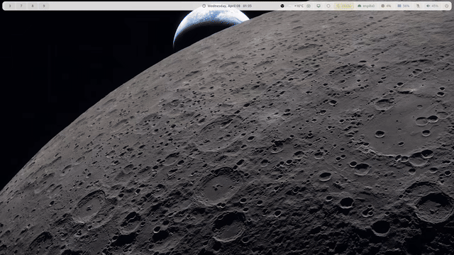
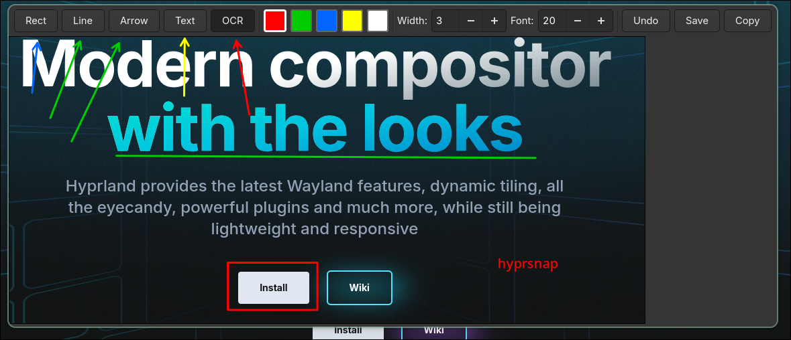

# hyprsnap

Powerful and simple screenshot software for Hyprland.

Take a region screenshot, annotate it with shapes and text, then copy or save — all from a single keybinding. Also includes a standalone OCR mode that extracts text from any screen region directly to your clipboard.

Built with Rust + GTK4 + Cairo.





## Features

**Annotation editor** (Super+Shift+S)
- Region screenshot via [hyprshot](https://github.com/Gustash/Hyprshot), shows a thumbnail preview
- Preview appears in the bottom-right corner for 5 seconds — click to open the full editor, or let it auto-close
- Draw rectangles, lines, and arrows (drag to draw)
- Add text annotations (click to place, type, Enter to confirm)
- Adjustable stroke width and font size
- Color picker (red, green, blue, yellow, white)
- Undo with Ctrl+Z
- Save annotated image (Ctrl+S) or press `s` to save and close
- Copy annotated image to clipboard (Ctrl+C) or press `c` to copy and close

**OCR mode** (Super+Shift+O)
- Select any screen region, text is extracted via Tesseract and copied to clipboard
- Shows a notification with the detected text

## Dependencies

- Hyprland
- [hyprshot](https://github.com/Gustash/Hyprshot)
- GTK4, Cairo
- Tesseract OCR
- wl-clipboard
- Rust toolchain

## Install

```bash
git clone https://github.com/dsoignoo/hyprsnap.git
cd hyprsnap
make install
```

This will:
1. Install system dependencies (supports `pacman` and `zypper`)
2. Build the Rust binary
3. Install `hyprsnap`, `screenshot-edit`, and `ocr-select` to `~/.local/bin`

Then add to your Hyprland config (`~/.config/hypr/hyprland.conf`):

```
# Screenshot editor
bind = $mod SHIFT, S, exec, ~/.local/bin/screenshot-edit

# OCR select
bind = $mod SHIFT, O, exec, ~/.local/bin/ocr-select

# Float the editor and preview windows
windowrule {
    match:title = ^Screenshot Editor$
    float = true
    center = true
}

windowrule {
    match:title = ^Screenshot Preview$
    float = true
}
```

Reload your config:

```bash
hyprctl reload
```

## Configuration

After installing, you can customize the behavior by editing the wrapper scripts in `~/.local/bin/`.

**Change the save directory** — edit `~/.local/bin/screenshot-edit`:

```bash
# Launch the annotation editor with a custom save directory
"$HOME/.local/bin/hyprsnap" --save-dir "$HOME/Pictures/screenshots" "$SCREENSHOT_PATH"
```

By default, screenshots are saved next to the original temporary file. Adding `--save-dir` lets you save annotated screenshots to a permanent location like `~/Pictures/screenshots`.

**Available options for hyprsnap:**

| Option | Description |
|---|---|
| `--preview` | Start in preview mode (thumbnail, auto-close after 5s, click to edit) |
| `--save-dir <dir>` | Directory where annotated screenshots are saved |

> **Note:** `make install` will not overwrite your modified scripts — it prompts before replacing them.

## Disclaimer

This is a bit hacky in some ways — it was vibe coded with [Claude](https://claude.ai) and gets the job done, but don't expect polish.

## Uninstall

```bash
make uninstall
```

Remove the keybindings from your Hyprland config manually.
